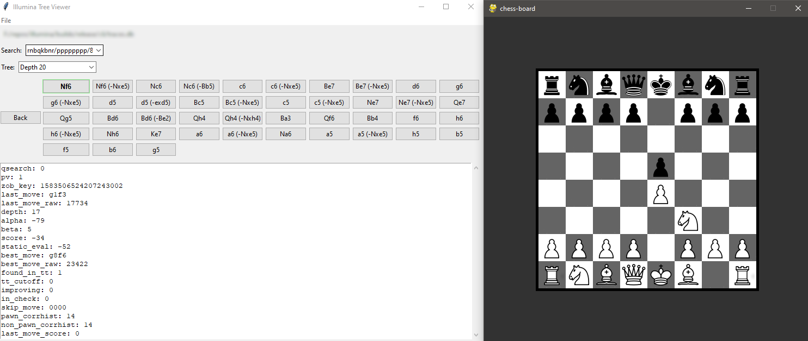

# Illumina viewer

This viewer consists of a simple python script that allows graphically visualizing [Illumina](https://github.com/mergener/illumina)'s traced searches.



## Setup

Inside illumina-viewer's directory, run the following commands:

- Linux:
```bash
python -m venv venv
source venv/bin/activate
pip install -r requirements.txt
```

- Windows:
```cmd
python -m venv venv
venv\Scripts\activate
pip install -r requirements.txt
```

The above commands will create a virtual environment and install the required dependencies.

## Usage

### Generating a trace file
We assume you have a traced search file from Illumina and is familiar with its usage. Otherwise, refer to Illumina's [repository](https://github.com/mergener/illumina) 

To generate a trace file, run Illumina's search using `go trace <search args...>`. By default, this will generate a `traces.db` file (you can change this using the `TraceFile` UCI option).

### Running the viewer
To run the viewer, first activate your virtual environment:

- Linux
```bash
source venv/bin/activate
``` 

- Windows
```cmd
venv\Scripts\activate
```

Then, simply run:

```bash
python viewer.py
```

This will open the viewer's UI. Click on `File -> Open` and select the trace file you generated. The viewer will display the search tree.

Once the trace file is open, you can select different searches and trees to navigate. Searches correspond to `go` calls, while each tree matches an aspiration window iteration. 

After the desired search and trees are selected using the comboboxes, you can navigate all nodes visited by Illumina and see information about them.